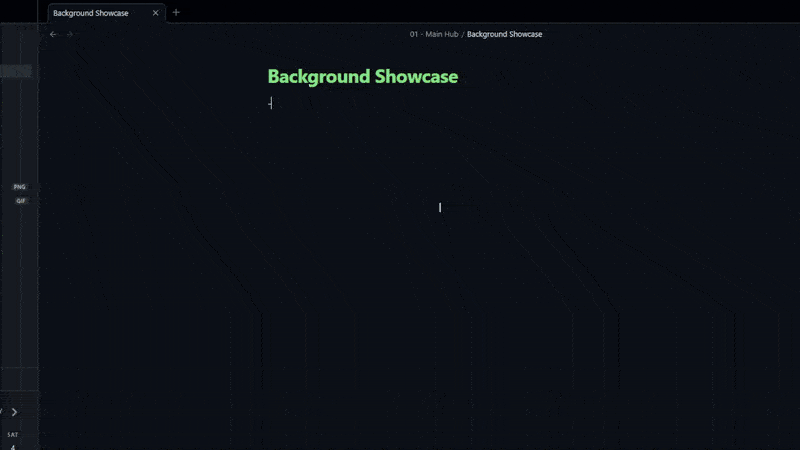

# Obsidian Note Background Snippet

CSS snippet for Obsidian that sets a fixed, customizable background image for individual notes. It forces all note content (text, blocks, and other images) to remain fully opaque and readable above the background.



---

## Installation

1.  Place the `Backgrounds.css` file into  **\YourVault\.obsidian\snippets**.
2.  Go to **Settings** -> **Appearance** -> **CSS Snippets**.
3.  Toggle the **Note Background Image** snippet **ON**.

## Usage

To activate the background on any note:

1.  **Add Class:** Add the class `cssclasses: background` to the note's **Properties**.
    ```yaml
    ---
    cssclasses: background
    ---
    ```
2.  **Embed Image:** Embed your background image using the alias **`background`**.
    ```markdown
    ![[path/to/my-image.jpg|background]]
    ```

## Customization

Install the **Style Settings** plugin. In its settings, find **Background Settings** to adjust:

* **Opacity:** Sets image transparency.
* **Blur Effect:** Controls image blur.
* **Saturation:** Adjusts color intensity.
* **Mobile Blur Effect:** Reduces blur on narrow panes for performance.
